# Architecture Documentation — HIS Analyzer

> Generated from GitNexus knowledge graph: 4,365 symbols, 8,239 relationships, 300 execution flows, 117 clusters.

## Overview

HIS Analyzer is a **Hospital Information System Migration Toolkit** built with Python. It provides two interfaces:

1. **Streamlit Web UI** (`app.py`) — an interactive dashboard for schema mapping, migration engine control, pipeline design, ER diagrams, file exploration, and datasource management.
2. **FastAPI REST API** (`api/main.py`) — a programmatic interface for datasources, configs, pipelines, pipeline runs, jobs, data explorers, transformers, and validators. Includes WebSocket support via Socket.IO.

The system follows a **layered MVC architecture** with Protocol-based abstractions for extensibility (dialects, transformers, validators).

---

## High-Level Architecture

```mermaid
graph TB
    subgraph UI_Layer["UI Layer"]
        ST["Streamlit App<br/>app.py"]
        API["FastAPI App<br/>api/main.py"]
        WS["Socket.IO<br/>WebSocket"]
    end

    subgraph Controller_Layer["Controller Layer"]
        C_SETTINGS["settings_controller"]
        C_PIPELINE["pipeline_controller"]
        C_SCHEMA["schema_mapper_controller"]
        C_MIGRATION["migration_engine_controller"]
        C_ER["er_diagram_controller"]
        C_EXPLORER["file_explorer_controller"]
    end

    subgraph View_Layer["View Layer"]
        V_SETTINGS["settings.py"]
        V_PIPELINE["pipeline_view.py"]
        V_SCHEMA["schema_mapper.py"]
        V_MIGRATION["migration_engine.py"]
        V_ER["er_diagram_view.py"]
        V_EXPLORER["file_explorer_view.py"]
        subgraph Components["View Components"]
            VC_SM["schema_mapper/<br/>mapping_editor, config_actions,<br/>source_selector, metadata_editor,<br/>history_viewer"]
            VC_ME["migration/<br/>step_config, step_review,<br/>step_connections, step_execution"]
            VC_SHARED["shared/<br/>dialogs, styles"]
        end
    end

    subgraph Service_Layer["Service Layer"]
        S_PIPELINE["pipeline_service"]
        S_QUERY["query_executor"]
        S_INSPECTOR["schema_inspector"]
        S_CONNECTOR["db_connector"]
        S_MIGRATION["migration_executor"]
        S_CHECKPOINT["checkpoint_manager"]
        S_POOL["connection_pool"]
        S_TESTER["connection_tester"]
        S_ENCODER["encoding_helper"]
        S_LOGGER["migration_logger"]
        S_ML["ml_mapper"]
        S_VALIDATOR["sql_validator"]
        S_BUILDER["query_builder"]
        S_TRANSFORM["transformers"]
        S_DS_REPO["datasource_repository<br/>(service adapter)"]
    end

    subgraph Repository_Layer["Repository Layer"]
        R_BASE["base.py<br/>(init_db, BaseRepo)"]
        R_DS["datasource_repo"]
        R_CONFIG["config_repo"]
        R_PIPELINE["pipeline_repo"]
        R_RUN["pipeline_run_repo"]
        R_NODE["pipeline_node_repo"]
        R_EDGE["pipeline_edge_repo"]
        R_JOB["job_repo"]
        R_CONN["connection.py<br/>(engine, transaction)"]
        R_UTILS["utils.py<br/>(row_to_dict)"]
    end

    subgraph Extensibility["Extensibility Layer"]
        D_REGISTRY["Dialects Registry<br/>MySQL, MSSQL, PostgreSQL"]
        DT_REGISTRY["Transformers Registry<br/>dates, names, healthcare,<br/>text, lookup, data_type"]
        V_REGISTRY["Validators Registry<br/>required, thai_id, common"]
    end

    subgraph Model_Layer["Model Layer"]
        M_DS["DatasourceRecord"]
        M_PIPELINE["PipelineRecord"]
        M_RUN["PipelineRunRecord"]
        M_CONFIG["ConfigRecord"]
        M_DBTYPE["DbType"]
        M_JOB["Job"]
    end

    subgraph Config["Configuration"]
        CFG["config.py<br/>DATABASE_URL, paths,<br/>registry accessors"]
        FACADE["database.py<br/>(re-export facade)"]
    end

    subgraph External["External Systems"]
        PG["PostgreSQL<br/>(Primary Storage)"]
        SRC_DB["Source HIS Database<br/>(MySQL/MSSQL/PostgreSQL)"]
        TGT_DB["Target HIS Database"]
    end

    ST --> C_SETTINGS & C_PIPELINE & C_SCHEMA & C_MIGRATION & C_ER & C_EXPLORER
    API --> WS
    API -.-> R_BASE & R_DS & R_CONFIG & R_PIPELINE & R_RUN & R_JOB

    C_SETTINGS --> V_SETTINGS
    C_PIPELINE --> V_PIPELINE
    C_SCHEMA --> V_SCHEMA
    C_MIGRATION --> V_MIGRATION
    C_ER --> V_ER
    C_EXPLORER --> V_EXPLORER

    V_SETTINGS --> V_SCHEMA & VC_SM
    V_PIPELINE --> V_PIPELINE & VC_ME
    V_SCHEMA --> VC_SM & VC_SHARED
    V_MIGRATION --> VC_ME & VC_SHARED

    C_SCHEMA --> S_INSPECTOR & S_QUERY & S_DS_REPO
    C_PIPELINE --> S_PIPELINE & S_CHECKPOINT
    C_MIGRATION --> S_MIGRATION & S_BUILDER & S_LOGGER
    C_SETTINGS --> FACADE

    S_QUERY --> R_CONN & R_UTILS
    S_INSPECTOR --> R_CONN & D_REGISTRY
    S_CONNECTOR --> R_CONN & D_REGISTRY
    S_MIGRATION --> S_QUERY & S_TRANSFORM & S_CHECKPOINT
    S_POOL --> R_CONN
    S_TESTER --> R_CONN & D_REGISTRY
    S_DS_REPO --> FACADE

    FACADE --> R_DS & R_CONFIG & R_PIPELINE & R_RUN & R_BASE
    R_CONN --> PG
    R_BASE --> PG
    R_DS --> R_CONN
    R_CONFIG --> R_CONN
    R_PIPELINE --> R_CONN
    R_RUN --> R_CONN
    R_JOB --> R_CONN

    S_INSPECTOR --> SRC_DB
    S_QUERY --> SRC_DB & TGT_DB
    S_CONNECTOR --> SRC_DB & TGT_DB

    CFG --> D_REGISTRY & DT_REGISTRY & V_REGISTRY
    S_MIGRATION -.-> DT_REGISTRY & V_REGISTRY
```



---

## Functional Areas

The knowledge graph identifies **117 clusters** grouped into these major functional areas:

### 1. Schema Mapper (75 symbols, cohesion: 0.63)

The largest functional area, responsible for inspecting source database schemas and mapping columns to target configurations.

| Directory | Purpose |
|---|---|
| `controllers/schema_mapper_controller.py` | Orchestrates schema mapping workflow |
| `views/schema_mapper.py` | Page-level view rendering |
| `views/components/schema_mapper/` | Sub-components: `mapping_editor`, `config_actions`, `source_selector`, `metadata_editor`, `history_viewer` |
| `services/schema_inspector.py` | Reads table/column metadata from source databases |
| `services/ml_mapper.py` | ML-based column type suggestion |

### 2. Configs (45 symbols, cohesion: 0.83)

Highly cohesive module managing migration configuration records with versioning.

| Directory | Purpose |
|---|---|
| `repositories/config_repo.py` | CRUD + version history + diff for config records |
| `models/migration_config.py` | `ConfigRecord` data model |
| `database.py` (re-exports) | Facade for backward compatibility |

### 3. Services (multiple clusters, ~130 total symbols)

Core business logic distributed across several cohesive service clusters:

| Service | Purpose |
|---|---|
| `services/pipeline_service.py` | Pipeline execution orchestration with adapter pattern |
| `services/query_executor.py` | Executes SQL against source/target databases |
| `services/query_builder.py` | Constructs migration SQL queries |
| `services/migration_executor.py` | Runs migration steps with checkpoint support |
| `services/checkpoint_manager.py` | Manages migration checkpoints for resumability |
| `services/connection_pool.py` | Database connection pooling |
| `services/connection_tester.py` | Validates database connectivity |
| `services/db_connector.py` | Connects to source/target databases |
| `services/encoding_helper.py` | Handles character encoding (Thai, CJK) |
| `services/migration_logger.py` | Logs migration step outcomes |
| `services/sql_validator.py` | Validates SQL before execution |
| `services/transformers.py` | Applies data transformation functions |
| `services/datasource_repository.py` | Service-layer adapter for datasource access |

### 4. Repositories (multiple clusters, ~60 total symbols)

Data access layer with PostgreSQL as the primary storage backend.

| Repository | Purpose |
|---|---|
| `repositories/base.py` | Schema init, base repository class |
| `repositories/connection.py` | SQLAlchemy engine & transaction management |
| `repositories/datasource_repo.py` | Datasource CRUD |
| `repositories/config_repo.py` | Config CRUD + versioning |
| `repositories/pipeline_repo.py` | Pipeline CRUD |
| `repositories/pipeline_run_repo.py` | Pipeline run tracking |
| `repositories/pipeline_node_repo.py` | Pipeline graph nodes |
| `repositories/pipeline_edge_repo.py` | Pipeline graph edges |
| `repositories/job_repo.py` | Background job persistence |
| `repositories/utils.py` | Shared utilities (`row_to_dict`) |

### 5. Pipelines (15 symbols, cohesion: 0.97)

Highly cohesive pipeline execution and job management.

| Directory | Purpose |
|---|---|
| `api/pipelines/` | Pipeline CRUD REST endpoints |
| `api/pipeline_runs/` | Pipeline run tracking endpoints |
| `api/jobs/` | Background job management + WebSocket events |
| `controllers/pipeline_controller.py` | Streamlit pipeline page controller |
| `views/pipeline_view.py` | Pipeline page rendering |

### 6. Data Transformers (17 symbols, cohesion: 0.65)

Pluggable data transformation pipeline for healthcare data.

| Module | Purpose |
|---|---|
| `data_transformers/base.py` | Base transformer protocol |
| `data_transformers/registry.py` | Transformer registration & lookup |
| `data_transformers/dates.py` | Buddhist/ISO date conversion |
| `data_transformers/names.py` | Thai/English name splitting |
| `data_transformers/healthcare.py` | HN generation, visit/patient/doctor ID lookup |
| `data_transformers/text.py` | Trim, uppercase, clean spaces |
| `data_transformers/lookup.py` | Cross-table value mapping |
| `data_transformers/data_type.py` | Type casting (float-to-int, bit cast) |

### 7. Dialects (6 symbols, cohesion: 1.0)

Perfectly cohesive — database-specific SQL dialect abstraction.

| Module | Purpose |
|---|---|
| `dialects/base.py` | Base dialect protocol |
| `dialects/registry.py` | Dialect registration (MySQL, MSSQL, PostgreSQL) |
| `dialects/mysql.py` | MySQL-specific SQL generation |
| `dialects/mssql.py` | MSSQL-specific SQL generation |
| `dialects/postgresql.py` | PostgreSQL-specific SQL generation |

### 8. Migration (multiple clusters, ~30 total symbols)

Migration engine with step-based execution, review, and checkpoint management.

| Directory | Purpose |
|---|---|
| `controllers/migration_engine_controller.py` | Orchestrates migration workflow |
| `views/migration_engine.py` | Migration page rendering |
| `views/components/migration/` | Step components: `step_config`, `step_review`, `step_connections`, `step_execution` |
| `migration_checkpoints/` | Checkpoint state persistence |
| `scripts/` | Migration helper scripts |

### 9. Validators (4 symbols)

Input validation with registry pattern.

| Module | Purpose |
|---|---|
| `validators/registry.py` | Validator registration |
| `validators/required.py` | Required field validation |
| `validators/thai_id.py` | Thai national ID validation |
| `validators/common.py` | Email, phone, date, numeric validators |

### 10. Protocols

Type-level interfaces defining extension contracts.

| Protocol | Purpose |
|---|---|
| `protocols/transformer.py` | Transformer interface |
| `protocols/validator.py` | Validator interface |
| `protocols/database_dialect.py` | Database dialect interface |
| `protocols/repository.py` | Repository interface |

---

## Key Execution Flows

### Flow 1: Pipeline Controller Run (10 steps, cross-community)

The main pipeline execution flow from Streamlit UI through to dialect resolution.

```
controllers/pipeline_controller.py::run
  → utils/state_manager.py::get (session state)
  → database.py::get_latest_run
    → repositories/pipeline_run_repo.py::get_latest
  → services/query_executor.py::execute
    → repositories/datasource_repo.py::get_by_id
    → repositories/connection.py::get_transaction
      → repositories/connection.py::get_engine
        → config.py::get_database_url
  → dialects/registry.py::get
```

### Flow 2: List Pipeline Runs via API (10 steps, cross-community)

REST API flow for retrieving pipeline runs with database access.

```
api/jobs/router.py::list_pipeline_runs
  → api/jobs/service.py::find_pipeline_runs
    → repositories/pipeline_run_repo.py::get_by_job
  → services/query_executor.py::execute
    → repositories/datasource_repo.py::get_by_id
    → repositories/connection.py::get_transaction
      → repositories/connection.py::get_engine
        → config.py::get_database_url
  → dialects/registry.py::available_types
```

### Flow 3: Migration Step Review (10 steps, cross-community)

Pre-migration review flow that validates source datasource connectivity.

```
views/components/migration/step_review.py::render_step_review
  → views/components/migration/step_review.py::_check_self_migration
  → services/datasource_repository.py::get_by_name
    → database.py::get_datasource_by_name
      → repositories/datasource_repo.py::get_by_name
  → repositories/connection.py::get_transaction
    → repositories/connection.py::get_engine
      → config.py::get_database_url
  → dialects/registry.py::available_types
```

### Flow 4: Save Config to Database (9 steps, cross-community)

Configuration persistence flow with full database write path.

```
database.py::save_config_to_db
  → repositories/config_repo.py::save
    → services/query_executor.py::execute
      → repositories/datasource_repo.py::get_by_id
      → repositories/connection.py::get_transaction
        → repositories/connection.py::get_engine
          → config.py::get_database_url
  → dialects/registry.py::available_types
```

### Flow 5: Schema Mapper Config Save (9 steps, cross-community)

Saving a schema mapping configuration from the schema mapper UI.

```
views/components/schema_mapper/config_actions.py::do_save
  → views/components/schema_mapper/config_actions.py::_build_params
  → views/components/schema_mapper/config_actions.py::_resolve_dbname
  → services/datasource_repository.py::get_by_name
    → database.py::get_datasource_by_name
      → repositories/datasource_repo.py::get_by_name
  → services/query_executor.py::execute
    → repositories/datasource_repo.py::get_by_id
  → repositories/utils.py::row_to_dict
```

---

## Inter-Module Dependency Graph

Cross-community call weights showing the strongest dependencies:

| From | To | Weight | Notes |
|---|---|---|---|
| Services | Schema_mapper | 24 | Services heavily use schema mapping functions |
| Migration | Schema_mapper | 12 | Migration engine depends on schema mapper |
| Configs | Schema_mapper | 10 | Config loading triggers schema access |
| Data_transformers | Schema_mapper | 10 | Transformers interact with schema metadata |
| Tests | Services | 12 | Test suites exercise service layer |
| Tests | Repositories | 10 | Integration tests hit repository layer |
| Configs | Repositories | 9 | Config management via repository layer |
| Services | Repositories | 9 | Business logic delegates to data access |
| Views | Repositories | 7 | Views query data for rendering |
| Schema_mapper | Views | 6 | Schema mapper feeds view rendering |
| Controllers | Schema_mapper | 6 | Controllers invoke schema mapping |
| Schema_mapper | Repositories | 6 | Schema mapper reads from DB |
| Base | Schema_mapper | 5 | Base utilities used by schema mapper |

---

## Technology Stack

| Layer | Technology |
|---|---|
| Web UI | Streamlit |
| REST API | FastAPI + Uvicorn |
| WebSocket | Socket.IO (python-socketio) |
| Database | PostgreSQL (SQLAlchemy) |
| Config | python-dotenv, environment variables |
| Testing | pytest |
| Linting | ruff |

---

## Database Connection Flow

All database access follows a consistent path through the connection layer:

```
config.py::get_database_url()
  → repositories/connection.py::get_engine()
    → repositories/connection.py::get_transaction()
      → repositories/*_repo.py::CRUD operations
        → services/query_executor.py::execute()
```

Dialect resolution (`dialects/registry.py`) ensures SQL is generated correctly for MySQL, MSSQL, or PostgreSQL source/target databases.

---

## API Routes

The FastAPI app (`api/main.py`) exposes these route groups:

| Route Prefix | Module | Purpose |
|---|---|---|
| `/datasources` | `api/datasources/` | Datasource CRUD |
| `/configs` | `api/configs/` | Migration config management |
| `/pipelines` | `api/pipelines/` | Pipeline CRUD |
| `/pipeline-runs` | `api/pipeline_runs/` | Pipeline run tracking |
| `/jobs` | `api/jobs/` | Background job management |
| `/data-explorers` | `api/data_explorers/` | Data exploration queries |
| `/transformers` | `api/transformers/` | Transformer registry info |
| `/validators` | `api/validators/` | Validator registry info |
| `/ws/socket.io/` | Socket.IO | WebSocket events |
| `/health` | Built-in | Health check |

All routes are protected by API key authentication (`api/base/auth.py`).
