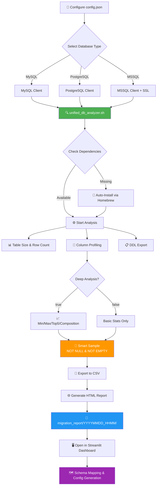

# HIS Database Migration Toolkit

[](https://github.com/yourusername/his-analyzer)
[](LICENSE)
[](https://www.gnu.org/software/bash/)
[](https://www.python.org/)

A comprehensive, enterprise-grade toolkit for analyzing, profiling, and migrating Hospital Information System (HIS) databases. This centralized dashboard provides end-to-end capabilities from database analysis and profiling to schema mapping and configuration generation.

## ✨ Features

- **🔍 Multi-Database Support**: Analyze MySQL, PostgreSQL, and MSSQL databases
- **📊 Deep Data Profiling**: Column-level statistics, data quality metrics, and composition analysis
- **🗂️ Schema Analysis**: Automatic DDL extraction with schema namespace support
- **🎯 Smart Sampling**: Intelligent data sampling with NULL and empty string filtering
- **🗺️ Interactive Schema Mapper**: Web-based UI for mapping source to target schemas
- **⚡ Auto-Dependency Management**: Automatic installation of required database clients
- **📈 HTML Reports**: Beautiful, interactive reports with DataTables integration
- **🔧 Configuration Generator**: Export migration configs in TypeScript/JSON format

---

## 📋 Table of Contents

- [Architecture](#architecture)
- [Requirements](#requirements)
- [Installation](#installation)
- [Quick Start](#quick-start)
- [Configuration](#configuration)
- [Usage](#usage)
- [Workflow](#workflow)
- [Advanced Features](#advanced-features)
- [Troubleshooting](#troubleshooting)
- [Contributing](#contributing)
- [License](#license)

---

## 🏗️ Architecture

```
his-analyzer/
├── app.py                      # Main Streamlit Dashboard Application
├── requirements.txt            # Python Dependencies
├── README.md                   # Documentation
│
├── analysis_report/            # Database Analysis Engine
│   ├── config.json                 # Database connection configuration
│   ├── unified_db_analyzer.sh      # Core analysis script (Bash)
│   ├── csv_to_html.py              # HTML report generator
│   └── migration_report/           # Analysis output directory
│       └── YYYYMMDD_HHMM/          # Timestamped report folders
│           ├── ddl_schema/             # DDL export (schema.sql)
│           ├── data_profile/           # CSV and HTML reports
│           └── process.log             # Execution logs
│
└── mini_his/                   # Mock Data Generator
    ├── gen_mini_his.py             # Python data generator
    └── full_his_mockup.sql         # Base SQL schema
```

---

## 🔧 Requirements

### System Requirements

- **Operating System**: Linux, macOS, Windows (via WSL2)
- **Shell**: Bash 4.0+ (auto-switch on macOS)
- **Python**: 3.8 or higher
- **RAM**: 4GB minimum, 8GB+ recommended for large databases

### Database Clients

The toolkit requires database-specific clients:

- **MySQL**: `mysql-client`
- **PostgreSQL**: `libpq` (PostgreSQL client)
- **MSSQL**: `mssql-tools18` (with ODBC driver)

**Note**: On macOS with Homebrew, these dependencies are auto-installed when missing.

### Python Dependencies

- `streamlit >= 1.30.0` - Web dashboard framework
- `pandas >= 2.0.0` - Data manipulation
- `jq` - JSON processor (system package)

---

## 🚀 Installation

### Option 1: Virtual Environment (Recommended)

Using a virtual environment prevents version conflicts with system Python packages.

```bash
# 1. Clone the repository
git clone https://github.com/yourusername/his-analyzer.git
cd his-analyzer

# 2. Create virtual environment
python3 -m venv venv

# 3. Activate virtual environment
source venv/bin/activate        # macOS/Linux
# venv\Scripts\activate         # Windows

# 4. Install dependencies
pip install --upgrade pip
pip install -r requirements.txt
```

### Option 2: System-Wide Installation

```bash
# Install Python dependencies
pip3 install -r requirements.txt

# Install system dependencies (macOS with Homebrew)
brew install jq

# Install database clients as needed
brew install mysql-client
brew install libpq
brew tap microsoft/mssql-release && brew install mssql-tools18
```

---

## ⚡ Quick Start

### 1. Configure Database Connection

Edit `analysis_report/config.json`:

```json
{
  "database": {
    "type": "mysql",
    "host": "localhost",
    "port": "3306",
    "name": "hospital_db",
    "user": "root",
    "password": "your_password",
    "schema": "",
    "tables": []
  },
  "sampling": {
    "default_limit": 10,
    "max_text_length": 300,
    "deep_analysis": true,
    "exceptions": []
  }
}
```

### 2. Run Database Analysis

```bash
cd analysis_report
./unified_db_analyzer.sh
```

**Output**: Creates timestamped report in `migration_report/YYYYMMDD_HHMM/`

### 3. Launch Dashboard

```bash
# Return to project root
cd ..

# Start Streamlit dashboard
streamlit run app.py --server.runOnSave true
```

**Access**: Opens browser at http://localhost:8501

---

## ⚙️ Configuration

### Database Configuration

#### Basic Settings

| Field | Description | Example |
|-------|-------------|---------|
| `type` | Database type | `mysql`, `postgresql`, `mssql` |
| `host` | Database host | `localhost`, `192.168.1.100` |
| `port` | Database port | `3306`, `5432`, `1433` |
| `name` | Database name | `hospital_db` |
| `user` | Username | `admin` |
| `password` | Password | `secure_password` |
| `schema` | Schema name (optional) | `public`, `dbo` |
| `tables` | Specific tables (optional) | `["patients", "visits"]` |

#### Schema Support (v7.0+)

Specify database schema for PostgreSQL and MSSQL:

```json
{
  "database": {
    "type": "postgresql",
    "schema": "public",
    ...
  }
}
```

**Defaults**:
- PostgreSQL: `public`
- MSSQL: `dbo`
- MySQL: Not applicable

#### Sampling Configuration

| Parameter | Description | Default |
|-----------|-------------|---------|
| `default_limit` | Number of sample rows | `10` |
| `max_text_length` | Max characters for text fields | `300` |
| `deep_analysis` | Enable detailed statistics | `true` |
| `exceptions` | Per-column overrides | `[]` |

#### Exception Rules

Override sampling limits for specific columns:

```json
{
  "sampling": {
    "exceptions": [
      { "table": "patients", "column": "notes", "limit": 3 },
      { "table": "visits", "column": "diagnosis", "limit": 5 }
    ]
  }
}
```

---

## 📖 Usage

### Database Analysis Script

```bash
cd analysis_report
./unified_db_analyzer.sh
```

**Features**:
- Auto-detects database type from `config.json`
- Checks and installs missing dependencies (macOS with Homebrew)
- Exports DDL schema to `schema.sql`
- Generates CSV data profile
- Creates interactive HTML report
- Logs all operations to `process.log`

**Output Structure**:
```
migration_report/20251124_0023/
├── ddl_schema/
│   └── schema.sql              # Complete DDL export
├── data_profile/
│   ├── data_profile.csv        # Raw profiling data
│   └── data_profile.html       # Interactive report
└── process.log                 # Execution log
```

### Streamlit Dashboard

The dashboard provides several interfaces:

#### 📊 **Schema Mapper**
- Load analysis reports
- View table and column statistics
- Map source to target fields
- Select data transformers and validators
- Generate TypeScript/JSON configurations

#### 🔍 **DDL Explorer**
- Browse database schema
- Click tables to view CREATE statements
- Navigate foreign key relationships

#### 🎲 **Mock Data Generator**
- Generate test data for migration testing
- Configurable data volumes
- Realistic HIS data patterns

---

## 🔄 Workflow



### Step-by-Step Migration Process

1. **Database Analysis**
   - Configure `config.json` with source database credentials
   - Run `./unified_db_analyzer.sh`
   - Review generated reports

2. **Schema Mapping**
   - Launch Streamlit dashboard
   - Navigate to **Schema Mapper**
   - Load analysis report
   - Map source fields to target schema
   - Select transformers (e.g., date format converters, string normalizers)

3. **Configuration Export**
   - Generate TypeScript/JSON configuration
   - Integrate with migration pipeline
   - Test with mock data if needed

4. **Migration Execution**
   - Use generated config with your ETL tool
   - Monitor data quality metrics
   - Validate migrated data

---

## 🚀 Advanced Features

### Deep Analysis Mode

Enable comprehensive data profiling:

```json
{
  "sampling": {
    "deep_analysis": true
  }
}
```

**Metrics Collected**:

| Metric | Basic Mode | Deep Mode |
|--------|------------|-----------|
| Row Count | ✅ | ✅ |
| Null Count | ✅ | ✅ |
| Distinct Values | ✅ | ✅ |
| Min/Max Values | ❌ | ✅ |
| Top 5 Frequency | ❌ | ✅ |
| Data Composition | ❌ | ✅ (Valid/Null/Empty/Zero) |
| Sample Data | ✅ | ✅ (Smart filtered) |

**Performance Considerations**:
- **Basic Mode**: Fast, suitable for large tables (millions of rows)
- **Deep Mode**: Slower, recommended for detailed migration planning

### Smart Sample Data (v7.1+)

Automatically filters sample data to show only meaningful values:

**Filtering Rules**:
- Excludes `NULL` values
- Excludes empty strings (`''`)
- Shows actual representative data

**Implementation** (MySQL example):
```sql
SELECT DISTINCT column_name
FROM table_name
WHERE column_name IS NOT NULL
  AND CAST(column_name AS CHAR) <> ''
LIMIT 10;
```

### Auto-Dependency Installation

On macOS with Homebrew, missing database clients are automatically installed:

```bash
# Example: Installing MSSQL tools
❌ Error: Command 'sqlcmd' not found
🍺 Homebrew detected...
❓ Install 'mssql-tools18' now? (y/N): y
📦 Installing mssql-tools18...
   -> Tapping microsoft/mssql-release...
   -> Installing packages...
✅ Installation successful!
```

### Interactive HTML Reports

Generated HTML reports include:

- **Overview Tab**: Table-level metrics with sortable DataTable
- **Column Detail Tab**: Comprehensive column-level statistics
- **Formulas & Docs Tab**: Data quality score explanations
- **Process Log Tab**: Complete execution logs

**Features**:
- Responsive design with Bootstrap 5
- Interactive tables with search/filter/sort
- Data quality visualizations
- Exportable to Excel/CSV/PDF

---

## 🐛 Troubleshooting

### Common Issues

#### Issue: `TypeError: data_editor() got an unexpected keyword argument 'selection_mode'`

**Cause**: Outdated Streamlit version (< 1.30.0)

**Solution**:
```bash
# Option 1: Use virtual environment (recommended)
python3 -m venv venv
source venv/bin/activate
pip install --upgrade streamlit

# Option 2: Force reinstall
pip uninstall streamlit -y
pip install --upgrade --force-reinstall streamlit
```

#### Issue: MSSQL SSL Certificate Error

**Cause**: Self-signed or untrusted SSL certificate

**Solution**: The toolkit automatically adds `-C` flag to trust server certificates:
```bash
sqlcmd -S host,port -C -U user -P password ...
```

#### Issue: `Must declare the scalar variable '@VariableName'`

**Cause**: T-SQL variable scope in dynamic SQL

**Solution**: Already handled in v7.1+ with proper variable injection

#### Issue: Empty CSV Output

**Cause**: Incorrect schema name (e.g., using default `public` for MSSQL)

**Solution**: Specify correct schema in `config.json`:
```json
{
  "database": {
    "type": "mssql",
    "schema": "dbo"
  }
}
```

### Getting Help

1. Check the `process.log` in the report folder
2. Review error messages in the terminal output
3. Verify database connectivity with native clients:
   ```bash
   mysql -h host -u user -p
   psql -h host -U user -d database
   sqlcmd -S host,port -U user -P password
   ```
4. Open an issue on GitHub with:
   - Error message
   - Database type and version
   - Operating system
   - Relevant log excerpts

---

## 🧪 Testing

### Run Mock Data Generator

```bash
cd mini_his
python gen_mini_his.py
```

### Test Database Analysis

```bash
cd analysis_report

# Edit config.json to point to test database
./unified_db_analyzer.sh

# Verify output
ls -lh migration_report/*/data_profile/data_profile.csv
```

---

## 📊 Performance Benchmarks

Approximate analysis times (single table):

| Rows | Columns | Basic Mode | Deep Mode |
|------|---------|------------|-----------|
| 10K | 20 | ~2s | ~5s |
| 100K | 50 | ~10s | ~30s |
| 1M | 100 | ~30s | ~2min |
| 10M+ | 200+ | ~2min | ~10min+ |

**Optimization Tips**:
- Use `tables` filter to analyze specific tables only
- Disable `deep_analysis` for initial exploration
- Adjust `default_limit` for faster sampling

---

## 🤝 Contributing

Contributions are welcome! Please follow these guidelines:

### Reporting Bugs

- Use GitHub Issues
- Include error messages and logs
- Provide reproduction steps
- Specify environment details

### Suggesting Features

- Open a GitHub Discussion
- Describe use case and benefits
- Provide examples if possible

### Pull Requests

1. Fork the repository
2. Create a feature branch (`git checkout -b feature/amazing-feature`)
3. Commit changes (`git commit -m 'Add amazing feature'`)
4. Push to branch (`git push origin feature/amazing-feature`)
5. Open a Pull Request

**Code Standards**:
- Bash scripts: Follow ShellCheck recommendations
- Python: PEP 8 style guide
- Add comments for complex logic
- Update documentation for new features

---

## 📝 License

This project is licensed under the MIT License - see the [LICENSE](LICENSE) file for details.

---

## 🙏 Acknowledgments

- Built for healthcare professionals managing HIS migrations
- Inspired by enterprise database migration challenges
- Community feedback and contributions welcome

---

## 📞 Support

- **Documentation**: This README and inline code comments
- **Issues**: [GitHub Issues](https://github.com/yourusername/his-analyzer/issues)
- **Discussions**: [GitHub Discussions](https://github.com/yourusername/his-analyzer/discussions)

---

## 🗺️ Roadmap

- [ ] Support for Oracle Database
- [ ] REST API for programmatic access
- [ ] Docker containerization
- [ ] CI/CD pipeline integration
- [ ] Data anonymization features
- [ ] Migration progress tracking
- [ ] Rollback capabilities

---

**Made with ❤️ for the HIS migration community**
