# HIS Database Migration Toolkit

[](https://github.com/yourusername/his-analyzer)
[](LICENSE)
[](https://www.gnu.org/software/bash/)
[](https://www.python.org/)

A comprehensive, enterprise-grade toolkit for analyzing, profiling, and migrating Hospital Information System (HIS) databases. This centralized dashboard provides end-to-end capabilities from database analysis and profiling to schema mapping and configuration generation with live database connectivity.

## ✨ Features

### Core Features
- **🔍 Multi-Database Support**: Analyze MySQL, PostgreSQL, and MSSQL databases
- **📊 Deep Data Profiling**: Column-level statistics, data quality metrics, and composition analysis
- **🗂️ Schema Analysis**: Automatic DDL extraction with schema namespace support
- **🎯 Smart Sampling**: Intelligent data sampling with NULL and empty string filtering
- **⚡ Auto-Dependency Management**: Automatic installation of required database clients
- **📈 HTML Reports**: Beautiful, interactive reports with DataTables integration
- **🔧 Configuration Generator**: Export migration configs in TypeScript/JSON format

### New in v8.0
- **🗄️ Datasource Management**: Centralized database connection profiles with SQLite storage
- **🔌 Connection Pooling**: Singleton pattern for efficient connection reuse across requests
- **🗺️ Enhanced Schema Mapper**: Dual-mode source selection (Run ID or Live Datasource)
- **📡 Live Schema Discovery**: Dynamic table and column loading from connected databases
- **💡 Smart Column Suggestions**: Auto-suggest target columns from actual database schema
- **🎛️ Configuration Repository**: Save and load mapping configurations from project database
- **📚 Configuration History**: Version tracking with comparison and rollback capabilities
- **🚀 Migration Engine**: Production-ready ETL execution with batch processing and logging
- **🤖 AI-Powered Mapping**: Semantic column matching using ML transformers and healthcare dictionaries

---

## 📋 Table of Contents

- [Architecture](#architecture)
- [Requirements](#requirements)
- [Installation](#installation)
- [Quick Start](#quick-start)
- [Configuration](#configuration)
- [Usage](#usage)
  - [Shell Script vs Python/Tools](#automated-data-profiling-shell-script-vs-pythontools)
  - [Database Analysis](#database-analysis-script)
  - [Streamlit Dashboard](#streamlit-dashboard)
- [Workflow](#workflow)
- [Advanced Features](#advanced-features)
  - [Configuration History & Version Control](#configuration-history--version-control-v80)
  - [Migration Engine](#migration-engine-v80)
  - [AI-Powered Column Mapping](#ai-powered-column-mapping-v80)
- [Troubleshooting](#troubleshooting)
- [Contributing](#contributing)
- [License](#license)

---

## 🏗️ Architecture

```
his-analyzer/
├── app.py                      # Main Streamlit Dashboard Application
├── requirements.txt            # Python Dependencies
├── README.md                   # Documentation
├── migration_tool.db           # SQLite database (datasources, configs, config_histories)
│
├── views/                      # Streamlit Pages
│   ├── schema_mapper.py            # Schema mapping interface (v8.0 enhanced)
│   │                                # • AI auto-mapping with ML models
│   │                                # • Dual-mode: Run ID or Live Datasource
│   │                                # • Configuration save/load with versioning
│   ├── migration_engine.py         # Migration execution engine (v8.0)
│   │                                # • Batch processing with streaming
│   │                                # • Data transformation pipeline
│   │                                # • Real-time logging and progress tracking
│   └── settings.py                 # Datasource & config management (v8.0)
│                                    # • Datasource CRUD operations
│                                    # • Configuration history viewer
│                                    # • Version comparison and rollback
│
├── services/                   # Business Logic
│   ├── db_connector.py             # Database connection pool (v8.0 refactored)
│   │                                # • Singleton pattern for connection reuse
│   │                                # • SQLAlchemy engine creation
│   ├── transformers.py             # Data transformation functions (v8.0)
│   │                                # • BUDDHIST_TO_ISO, TRIM, JSON parsing
│   │                                # • Batch transformer application
│   └── ml_mapper.py                # AI-powered mapping service (v8.0 NEW)
│                                    # • Sentence Transformers ML model
│                                    # • Healthcare domain dictionary
│                                    # • Sample data pattern analysis
│
├── database.py                 # SQLite operations (v8.0 enhanced)
│   │                                # • Datasources CRUD
│   │                                # • Configs CRUD with versioning
│   │                                # • config_histories table management
│   │                                # • Version comparison utilities
│
├── config.py                   # Application configuration
├── utils/                      # Utility functions
│   └── helpers.py                  # Common helper functions
│
├── analysis_report/            # Database Analysis Engine (Shell Script)
│   ├── config.json                 # Database connection configuration
│   ├── unified_db_analyzer.sh      # Core analysis script (Bash v7.1)
│   │                                # • Multi-database support (MySQL, PG, MSSQL)
│   │                                # • Smart sampling (NOT NULL, NOT EMPTY)
│   │                                # • Deep analysis mode
│   │                                # • Auto-dependency installation
│   ├── csv_to_html.py              # HTML report generator
│   └── migration_report/           # Analysis output directory
│       └── YYYYMMDD_HHMM/          # Timestamped report folders
│           ├── ddl_schema/             # DDL export (schema.sql)
│           ├── data_profile/           # CSV and HTML reports
│           └── process.log             # Execution logs
│
├── migration_logs/             # Migration execution logs (v8.0 NEW)
│   └── migration_NAME_TIMESTAMP.log    # Timestamped ETL logs
│
└── mini_his/                   # Mock Data Generator
    ├── gen_mini_his.py             # Python data generator
    └── full_his_mockup.sql         # Base SQL schema
```

### Data Flow Architecture (v8.0)

```
┌─────────────────────────────────────────────────────────────────┐
│                    ANALYSIS PHASE (Bash)                        │
├─────────────────────────────────────────────────────────────────┤
│  Source DB → unified_db_analyzer.sh → CSV/HTML Reports          │
│              • Profile data quality                             │
│              • Extract schema (DDL)                             │
│              • Calculate statistics                             │
└─────────────────────────────────────────────────────────────────┘
                            ↓
┌─────────────────────────────────────────────────────────────────┐
│                   MAPPING PHASE (Python + AI)                   │
├─────────────────────────────────────────────────────────────────┤
│  Schema Mapper (Streamlit)                                      │
│  ├── Load: CSV Report OR Live Datasource                        │
│  ├── AI Auto-Map: ML Model suggests column mappings             │
│  ├── Manual Review: User confirms/modifies                      │
│  ├── Transformer Selection: Date conv, trim, etc.              │
│  └── Save: Config → SQLite (with versioning)                    │
└─────────────────────────────────────────────────────────────────┘
                            ↓
┌─────────────────────────────────────────────────────────────────┐
│                  MIGRATION PHASE (Python ETL)                   │
├─────────────────────────────────────────────────────────────────┤
│  Migration Engine                                               │
│  ├── Load Config: From SQLite or JSON file                      │
│  ├── Connect: Source & Target via datasource profiles           │
│  ├── Extract: Batch streaming (pandas + SQLAlchemy)            │
│  ├── Transform: Apply transformers to each batch               │
│  ├── Load: Bulk insert to target (to_sql)                      │
│  └── Log: Real-time progress + persistent logs                 │
└─────────────────────────────────────────────────────────────────┘
                            ↓
┌─────────────────────────────────────────────────────────────────┐
│                  VERSIONING & AUDIT (SQLite)                    │
├─────────────────────────────────────────────────────────────────┤
│  migration_tool.db                                              │
│  ├── datasources: Connection profiles                          │
│  ├── configs: Current mapping configurations                   │
│  ├── config_histories: All versions with timestamps            │
│  └── Version comparison & rollback support                     │
└─────────────────────────────────────────────────────────────────┘
```

---

## 🔧 Requirements

### System Requirements

- **Operating System**: Linux, macOS, Windows (via WSL2)
- **Shell**: Bash 4.0+ (auto-switch on macOS)
- **Python**: 3.8 or higher
- **RAM**: 4GB minimum, 8GB+ recommended for large databases

### Database Clients

The toolkit requires database-specific clients:

- **MySQL**: `mysql-client`
- **PostgreSQL**: `libpq` (PostgreSQL client)
- **MSSQL**: `mssql-tools18` (with ODBC driver)

**Note**: On macOS with Homebrew, these dependencies are auto-installed when missing.

### Python Dependencies

- `streamlit >= 1.30.0` - Web dashboard framework
- `pandas >= 2.0.0` - Data manipulation
- `jq` - JSON processor (system package)

---

## 🚀 Installation

### Option 1: Virtual Environment (Recommended)

Using a virtual environment prevents version conflicts with system Python packages.

```bash
# 1. Clone the repository
git clone https://github.com/yourusername/his-analyzer.git
cd his-analyzer

# 2. Create virtual environment
python3 -m venv venv

# 3. Activate virtual environment
source venv/bin/activate        # macOS/Linux
# venv\Scripts\activate         # Windows

# 4. Install dependencies
pip install --upgrade pip
pip install -r requirements.txt
```

### Option 2: System-Wide Installation

```bash
# Install Python dependencies
pip3 install -r requirements.txt

# Install system dependencies (macOS with Homebrew)
brew install jq

# Install database clients as needed
brew install mysql-client
brew install libpq
brew tap microsoft/mssql-release && brew install mssql-tools18
```

---

## ⚡ Quick Start

### 1. Initialize Project Database

On first run, the application automatically creates `migration_tool.db` SQLite database:

```bash
# Start the Streamlit application
streamlit run app.py
```

**The database is created automatically** with the following tables:
- `datasources` - Stores database connection profiles
- `configs` - Stores schema mapping configurations

**No manual setup required!** The database initialization happens on application startup.

### 2. Configure Datasources (New in v8.0)

Navigate to **Settings** page in the Streamlit interface to manage datasources:

1. Click **"⚙️ Settings"** in the sidebar
2. Select **"Datasources"** tab
3. Click **"Add New Datasource"**
4. Fill in connection details:
   - Name (unique identifier)
   - Database Type (MySQL, PostgreSQL, MSSQL)
   - Host, Port, Database Name
   - Username, Password
5. Test connection
6. Save datasource

**Datasources are stored in SQLite** and reused across:
- Schema Mapper (source & target selection)
- Migration Engine (connection profiles)
- All database operations (via connection pool)

### 3. Configure Database Connection (Legacy - for Bash analyzer)

Edit `analysis_report/config.json`:

```json
{
  "database": {
    "type": "mysql",
    "host": "localhost",
    "port": "3306",
    "name": "hospital_db",
    "user": "root",
    "password": "your_password",
    "schema": "",
    "tables": []
  },
  "sampling": {
    "default_limit": 10,
    "max_text_length": 300,
    "deep_analysis": true,
    "exceptions": []
  }
}
```

### 4. Run Database Analysis (Optional - for CSV-based mapping)

```bash
cd analysis_report
./unified_db_analyzer.sh
```

**Output**: Creates timestamped report in `migration_report/YYYYMMDD_HHMM/`

**Note**: In v8.0, you can also connect directly to datasources in Schema Mapper, bypassing the need for analysis reports.

---

## ⚙️ Configuration

### Database Configuration

#### Basic Settings

| Field      | Description                | Example                        |
| ---------- | -------------------------- | ------------------------------ |
| `type`     | Database type              | `mysql`, `postgresql`, `mssql` |
| `host`     | Database host              | `localhost`, `192.168.1.100`   |
| `port`     | Database port              | `3306`, `5432`, `1433`         |
| `name`     | Database name              | `hospital_db`                  |
| `user`     | Username                   | `admin`                        |
| `password` | Password                   | `secure_password`              |
| `schema`   | Schema name (optional)     | `public`, `dbo`                |
| `tables`   | Specific tables (optional) | `["patients", "visits"]`       |

#### Schema Support (v7.0+)

Specify database schema for PostgreSQL and MSSQL:

```json
{
  "database": {
    "type": "postgresql",
    "schema": "public",
    ...
  }
}
```

**Defaults**:

- PostgreSQL: `public`
- MSSQL: `dbo`
- MySQL: Not applicable

#### Sampling Configuration

| Parameter         | Description                    | Default |
| ----------------- | ------------------------------ | ------- |
| `default_limit`   | Number of sample rows          | `10`    |
| `max_text_length` | Max characters for text fields | `300`   |
| `deep_analysis`   | Enable detailed statistics     | `true`  |
| `exceptions`      | Per-column overrides           | `[]`    |

#### Exception Rules

Override sampling limits for specific columns:

```json
{
  "sampling": {
    "exceptions": [
      { "table": "patients", "column": "notes", "limit": 3 },
      { "table": "visits", "column": "diagnosis", "limit": 5 }
    ]
  }
}
```

---

## 📖 Usage

### Automated Data Profiling: Shell Script vs Python/Tools

This toolkit uses a **pure Bash shell script** ([unified_db_analyzer.sh](analysis_report/unified_db_analyzer.sh)) for database profiling instead of Python ETL frameworks or commercial tools. Here's why:

#### Why Shell Script?

| Aspect | Shell Script Approach | Python/Tools Alternative |
|--------|----------------------|--------------------------|
| **Dependencies** | Minimal: `bash`, `jq`, native DB clients | Heavy: pandas, SQLAlchemy, various libraries |
| **Portability** | Runs anywhere with Bash 4.0+ | Requires Python environment setup |
| **Performance** | Direct database access, minimal overhead | Abstraction layers slow down queries |
| **Security** | No code execution risks, simple audit | Complex dependency chains, supply chain risks |
| **Maintenance** | Single 600-line script, easy to debug | Multiple packages, version conflicts |
| **Installation** | Auto-installs missing DB clients via Homebrew | Manual pip installs, virtual environments |

#### Benefits for ETL & Data Migration

**1. Zero-Setup Profiling**
```bash
# No Python, no pip install, no virtual env - just run
cd analysis_report
./unified_db_analyzer.sh
```

**2. Multi-Database Native Support**
- Directly uses `mysql`, `psql`, `sqlcmd` for optimal performance
- Schema-aware profiling (PostgreSQL `public`, MSSQL `dbo`)
- Handles database-specific quirks (MSSQL SSL certs, NULL warnings)

**3. Production-Ready Features**
- **Smart Sampling**: Filters NULL/empty values automatically
- **Deep Analysis Mode**: Min/Max, Top-5 frequencies, data composition
- **Exception Rules**: Per-column sampling limits
- **Table Size Calculation**: Actual disk usage in MB
- **DDL Export**: Complete schema with indexes and constraints

**4. Migration-Friendly Output**
- **CSV Format**: Universal, works with any ETL tool
- **HTML Reports**: Interactive DataTables for business users
- **Timestamped Runs**: Tracks profiling history (`YYYYMMDD_HHMM/`)
- **Process Logs**: Complete audit trail for compliance

**5. Real-World Migration Use Cases**
```bash
# Before migration: Profile source database
./unified_db_analyzer.sh  # Analyzes source system

# Review data quality, identify issues
open migration_report/20251130_1523/data_profile/data_profile.html

# Load into Streamlit for schema mapping
# Use profiling data to design transformations

# Execute migration with confidence
# Knowing exact data types, null counts, value ranges
```

**6. Shell Script Advantages for Migration**
- **Repeatable**: Run daily to track data changes over time
- **Scriptable**: Integrate into CI/CD pipelines
- **Offline**: Profile production DB, analyze on laptop (CSV export)
- **Auditable**: Single script = complete transparency
- **Fast**: No Python overhead, direct SQL execution

### Database Analysis Script

```bash
cd analysis_report
./unified_db_analyzer.sh
```

**Features**:

- Auto-detects database type from `config.json`
- Checks and installs missing dependencies (macOS with Homebrew)
- Exports DDL schema to `schema.sql`
- Generates CSV data profile with smart NULL/empty filtering
- Creates interactive HTML report with DataTables
- Logs all operations to `process.log`

**Output Structure**:

```
migration_report/20251124_0023/
├── ddl_schema/
│   └── schema.sql              # Complete DDL export
├── data_profile/
│   ├── data_profile.csv        # Raw profiling data
│   └── data_profile.html       # Interactive report
└── process.log                 # Execution log
```

### Streamlit Dashboard

The dashboard provides several interfaces:

#### 📊 **Schema Mapper** (v8.0 Enhanced)

**Dual Source Mode:**
- **Run ID Mode**: Load from CSV analysis reports (legacy)
- **Datasource Mode**: Connect directly to live database (new!)

**Features:**
- View table and column statistics
- Map source to target fields with live schema discovery
- Smart target column suggestions from actual database
- Select data transformers and validators
- Save/load configurations from project database
- Generate TypeScript/JSON configurations
- Export configurations as downloadable files

**Workflow:**
1. **Source Configuration**: Choose Run ID or Datasource
   - Run ID: Select from analysis report folders
   - Datasource: Select datasource → Choose table (auto-loads schema)
2. **Target Configuration**: Select target datasource and table
3. **Field Mapping**: Map source columns to target with suggestions
4. **Save Configuration**: Store in SQLite for reuse
5. **Export**: Download as JSON for migration tools

#### ⚙️ **Settings** (v8.0 New)

**Datasources Tab:**
- Add/Edit/Delete datasource profiles
- Test database connections
- View all configured datasources
- Secure credential storage in SQLite

**Saved Configs Tab:**
- View all saved schema mapping configurations
- Load configurations for editing
- Delete unused configurations
- Export configurations

#### 🚀 **Migration Engine**

- Select source and target from datasource profiles
- Load saved configurations from project database
- Upload configuration files
- Execute data migration (simulation mode)

#### 🔍 **DDL Explorer**

- Browse database schema
- Click tables to view CREATE statements
- Navigate foreign key relationships

#### 🎲 **Mock Data Generator**

- Generate test data for migration testing
- Configurable data volumes
- Realistic HIS data patterns

---

## 🔄 Workflow

```mermaid
flowchart TD
    A[📝 Configure config.json] --> B{Select Database Type}
    B -->|MySQL| C1[MySQL Client]
    B -->|PostgreSQL| C2[PostgreSQL Client]
    B -->|MSSQL| C3[MSSQL Client + SSL]

    C1 --> D[🔍 unified_db_analyzer.sh]
    C2 --> D
    C3 --> D

    D --> E{Check Dependencies}
    E -->|Missing| F[🔧 Auto-Install via Homebrew]
    E -->|Available| G
    F --> G[⚙️ Start Analysis]

    G --> H1[📊 Table Size & Row Count]
    G --> H2[🔎 Column Profiling]
    G --> H3[📋 DDL Export]

    H2 --> I{Deep Analysis?}
    I -->|true| J[📈 Min/Max/Top5/Composition]
    I -->|false| K[Basic Stats Only]

    J --> L[🎯 Smart Sample<br/>NOT NULL & NOT EMPTY]
    K --> L

    L --> M[💾 Export to CSV]
    M --> N[🌐 Generate HTML Report]
    N --> O[📂 migration_report/YYYYMMDD_HHMM/]

    O --> P[🖥️ Open in Streamlit Dashboard]
    P --> Q[🗺️ Schema Mapping & Config Generation]

    style D fill:#4CAF50,color:#fff
    style L fill:#FF9800,color:#fff
    style O fill:#2196F3,color:#fff
    style Q fill:#9C27B0,color:#fff
```



### Step-by-Step Migration Process

1. **Database Analysis**

   - Configure `config.json` with source database credentials
   - Run `./unified_db_analyzer.sh`
   - Review generated reports

2. **Schema Mapping**

   - Launch Streamlit dashboard
   - Navigate to **Schema Mapper**
   - Load analysis report
   - Map source fields to target schema
   - Select transformers (e.g., date format converters, string normalizers)

3. **Configuration Export**

   - Generate TypeScript/JSON configuration
   - Integrate with migration pipeline
   - Test with mock data if needed

4. **Migration Execution**
   - Use generated config with your ETL tool
   - Monitor data quality metrics
   - Validate migrated data

---

## 🚀 Advanced Features

### Connection Pooling (v8.0)

The toolkit uses a singleton connection pool pattern for efficient database operations:

**Benefits:**
- Reuses connections across multiple requests
- Automatic health checks and reconnection
- Significant performance improvement for repeated operations
- Thread-safe connection management

**How it works:**
```python
# First call - creates connection
get_tables_from_datasource(...)  # Creates new connection

# Second call - reuses connection (no overhead!)
get_columns_from_table(...)      # Reuses existing connection

# Connection stays alive for future requests
```

**Connection Management:**
- Connections are identified by unique hash (host, port, db, user)
- Dead connections are automatically detected and recreated
- All functions use autocommit mode for stability
- Connections persist across Streamlit reruns

**Manual Control:**
```python
from services.db_connector import close_connection, close_all_connections

# Close specific connection
close_connection(db_type, host, port, db_name, user)

# Close all connections (useful for cleanup)
close_all_connections()
```

### Project Database (v8.0)

**SQLite Storage:** `migration_tool.db`

**Tables:**

1. **datasources** - Database connection profiles
   ```sql
   CREATE TABLE datasources (
       id INTEGER PRIMARY KEY AUTOINCREMENT,
       name TEXT UNIQUE,
       db_type TEXT,
       host TEXT,
       port TEXT,
       dbname TEXT,
       username TEXT,
       password TEXT
   )
   ```

2. **configs** - Schema mapping configurations
   ```sql
   CREATE TABLE configs (
       id INTEGER PRIMARY KEY AUTOINCREMENT,
       config_name TEXT UNIQUE,
       table_name TEXT,
       json_data TEXT,
       updated_at TIMESTAMP
   )
   ```

**Automatic Initialization:**
- Database created on first application run
- No manual SQL scripts required
- Handles migrations automatically

### Schema Mapper Dual Mode (v8.0)

**Mode 1: Run ID (Traditional)**
- Uses CSV analysis reports
- Offline operation
- Historical data analysis
- Best for: Initial exploration, documented analysis

**Mode 2: Datasource (New)**
- Connects directly to live database
- Real-time schema discovery
- Auto-loads tables and columns
- Best for: Active development, latest schema

**Switching between modes:**
1. Open Schema Mapper
2. Select source mode (Run ID / Datasource)
3. Choose source accordingly
4. Schema Mapper adapts automatically

### Deep Analysis Mode

Enable comprehensive data profiling:

```json
{
  "sampling": {
    "deep_analysis": true
  }
}
```

**Metrics Collected**:

| Metric           | Basic Mode | Deep Mode                  |
| ---------------- | ---------- | -------------------------- |
| Row Count        | ✅         | ✅                         |
| Null Count       | ✅         | ✅                         |
| Distinct Values  | ✅         | ✅                         |
| Min/Max Values   | ❌         | ✅                         |
| Top 5 Frequency  | ❌         | ✅                         |
| Data Composition | ❌         | ✅ (Valid/Null/Empty/Zero) |
| Sample Data      | ✅         | ✅ (Smart filtered)        |

**Performance Considerations**:

- **Basic Mode**: Fast, suitable for large tables (millions of rows)
- **Deep Mode**: Slower, recommended for detailed migration planning

### Smart Sample Data (v7.1+)

Automatically filters sample data to show only meaningful values:

**Filtering Rules**:

- Excludes `NULL` values
- Excludes empty strings (`''`)
- Shows actual representative data

**Implementation** (MySQL example):

```sql
SELECT DISTINCT column_name
FROM table_name
WHERE column_name IS NOT NULL
  AND CAST(column_name AS CHAR) <> ''
LIMIT 10;
```

### Auto-Dependency Installation

On macOS with Homebrew, missing database clients are automatically installed:

```bash
# Example: Installing MSSQL tools
❌ Error: Command 'sqlcmd' not found
🍺 Homebrew detected...
❓ Install 'mssql-tools18' now? (y/N): y
📦 Installing mssql-tools18...
   -> Tapping microsoft/mssql-release...
   -> Installing packages...
✅ Installation successful!
```

### Interactive HTML Reports

Generated HTML reports include:

- **Overview Tab**: Table-level metrics with sortable DataTable
- **Column Detail Tab**: Comprehensive column-level statistics
- **Formulas & Docs Tab**: Data quality score explanations
- **Process Log Tab**: Complete execution logs

**Features**:

- Responsive design with Bootstrap 5
- Interactive tables with search/filter/sort
- Data quality visualizations
- Exportable to Excel/CSV/PDF

### Configuration History & Version Control (v8.0)

Track every change to your schema mapping configurations with built-in version control.

**How It Works:**

Every time you save a configuration, the system automatically:
1. Creates a new version entry in `config_histories` table
2. Preserves complete JSON snapshot with timestamp
3. Increments version number (v1, v2, v3...)
4. Links to parent configuration via foreign key

**Database Schema:**

```sql
-- Main configuration table
CREATE TABLE configs (
    id TEXT PRIMARY KEY,              -- UUID for relationships
    config_name TEXT UNIQUE,          -- User-facing name
    table_name TEXT,                  -- Source table
    json_data TEXT,                   -- Current config JSON
    updated_at TIMESTAMP              -- Last modification
);

-- Version history table
CREATE TABLE config_histories (
    id TEXT PRIMARY KEY,              -- Unique history entry ID
    config_id TEXT,                   -- Links to parent config
    version INTEGER,                  -- Sequential version number
    json_data TEXT,                   -- Config snapshot at this version
    created_at TIMESTAMP,             -- When this version was created
    FOREIGN KEY(config_id) REFERENCES configs(id) ON DELETE CASCADE
);
```

**Key Features:**

1. **Automatic Versioning**
   - No manual intervention needed
   - Every save creates a new version
   - Original version preserved forever

2. **Version Comparison**
   ```python
   # Compare two versions to see what changed
   diff = db.compare_config_versions("PatientMigration", version1=1, version2=3)
   # Returns:
   {
       'mappings_added': [...],      # New column mappings
       'mappings_removed': [...],    # Deleted mappings
       'mappings_modified': [...]    # Changed transformers/targets
   }
   ```

3. **Rollback Support**
   - View all historical versions in Settings page
   - Load any previous version
   - Restore deleted configurations from history

4. **Audit Trail**
   - Complete history of configuration changes
   - Timestamp for every modification
   - Useful for compliance and troubleshooting

**Use Cases:**

- **Migration Testing**: Try different mapping strategies, rollback if needed
- **Team Collaboration**: Track who changed what and when
- **Production Safety**: Restore last-known-good configuration quickly
- **Documentation**: Historical record of migration decisions

### Migration Engine (v8.0)

Production-ready ETL execution engine with enterprise features.

**Architecture:**

```
┌─────────────────┐      ┌──────────────────┐      ┌─────────────────┐
│  Source DB      │──────▶│  Migration       │──────▶│  Target DB      │
│  (via Profile)  │◀──┐   │  Engine          │   ┌──▶│  (via Profile)  │
└─────────────────┘   │   └──────────────────┘   │   └─────────────────┘
                      │            │              │
                      │            ▼              │
                      │   ┌──────────────────┐   │
                      │   │  Transformers    │   │
                      │   │  - Date Conv.    │   │
                      │   │  - Trim/Clean    │   │
                      │   │  - JSON Parse    │   │
                      │   └──────────────────┘   │
                      │                           │
                      │   ┌──────────────────┐   │
                      └───│  Config JSON     │───┘
                          │  (Mappings)      │
                          └──────────────────┘
```

**Key Features:**

**1. Batch Processing**
- Configurable batch size (default: 1000 rows)
- Streaming execution - handles millions of rows
- Memory-efficient: processes one chunk at a time
- Progress tracking with visual progress bar

**2. Smart Query Generation**
```python
# Only selects mapped columns - reduces network overhead
SELECT "hn", "fname", "lname", "dob" FROM patients
# Instead of SELECT * (which transfers unused data)
```

**3. Data Transformation Pipeline**
```python
for batch in data_iterator:
    # 1. Fetch batch (1000 rows)
    df_batch = pd.read_sql(query, source_engine, chunksize=1000)

    # 2. Apply transformers (in-memory)
    df_batch = DataTransformer.apply_transformers_to_batch(df_batch, config)

    # 3. Rename columns to match target schema
    df_batch.rename(columns=rename_map, inplace=True)

    # 4. Bulk insert to target
    df_batch.to_sql(target_table, target_engine, if_exists='append')
```

**4. Comprehensive Logging**
- Real-time log viewer in UI
- Persistent log files: `migration_logs/migration_NAME_TIMESTAMP.log`
- Audit trail: timestamps, row counts, errors
- Downloadable after completion

**5. Test Mode**
- Process only 1 batch (configurable limit)
- Validate mappings without full migration
- Dry-run capability for safety

**6. Error Handling**
- Transaction-safe batch commits
- Stops on first error (prevents data corruption)
- Detailed error messages with context
- Rollback support (database-dependent)

**Execution Workflow:**

```bash
Step 1: Select Configuration
  ├── Load from Project Database (saved configs)
  └── Upload JSON File (external configs)

Step 2: Test Connections
  ├── Select Source Datasource
  ├── Select Target Datasource
  ├── Verify connectivity
  └── Health checks

Step 3: Review & Settings
  ├── View configuration JSON
  ├── Set batch size
  ├── Enable/disable test mode
  └── Confirm execution

Step 4: Execute Migration
  ├── Connect to databases (SQLAlchemy engines)
  ├── Generate optimized SELECT query
  ├── Stream data in batches
  ├── Apply transformations
  ├── Bulk insert to target
  └── Log everything
```

**Performance Characteristics:**

| Dataset Size | Batch Size | Approx. Time | Memory Usage |
|-------------|------------|--------------|--------------|
| 10K rows    | 1000       | ~10 seconds  | < 50 MB      |
| 100K rows   | 1000       | ~1-2 minutes | < 200 MB     |
| 1M rows     | 1000       | ~10-15 min   | < 500 MB     |
| 10M+ rows   | 5000       | ~1-2 hours   | < 1 GB       |

**Use Cases:**

- **One-time Migrations**: Legacy system to new platform
- **Continuous Sync**: Nightly data transfers
- **Data Warehouse ETL**: OLTP → OLAP transformations
- **Multi-tenant Migrations**: Hospital A → Hospital B
- **Testing**: Validate transformations with test mode

### AI-Powered Column Mapping (v8.0)

Intelligent column matching using machine learning and healthcare domain knowledge.

**Technology Stack:**

- **Model**: `sentence-transformers/paraphrase-multilingual-MiniLM-L12-v2`
- **Framework**: Sentence Transformers (Hugging Face)
- **Similarity**: Cosine similarity on semantic embeddings
- **Domain**: Healthcare Information Systems (HIS)

**How It Works:**

**1. Dual-Strategy Matching**

```python
# Strategy 1: Rule-Based Dictionary (Priority)
his_dictionary = {
    "hn": ["hn", "hospital_number", "mrn", "patient_code"],
    "cid": ["cid", "national_id", "card_id", "citizen_id"],
    "vn": ["vn", "visit_number", "visit_no"],
    # ... 30+ healthcare terms
}

# Strategy 2: Semantic AI Matching (Fallback)
# Encodes column names into 384-dimensional vectors
# Compares similarity using cosine distance
source_embedding = model.encode("patient_firstname")
target_embeddings = model.encode(["fname", "first_name", "given_name"])
best_match = argmax(cosine_similarity(source_embedding, target_embeddings))
```

**2. Confidence Scoring**

- **Exact Match**: 1.0 (100% confidence)
- **Dictionary Match**: 0.9 (90% confidence)
- **Semantic Match**: 0.4-0.9 (threshold-based)
- **No Match**: 0.0 (suggests manual review)

**3. Sample Data Analysis**

Analyzes actual column values to suggest transformers:

```python
# Example: Detects Thai Buddhist year dates
sample_values = ["2566-01-15", "2567-03-20", "2565-12-01"]
analysis = ml_mapper.analyze_column_with_sample(
    source_col="admit_date",
    target_col="admission_date",
    sample_values=sample_values
)
# Returns:
{
    "confidence_score": 0.9,
    "transformers": ["BUDDHIST_TO_ISO"],  # Auto-suggested
    "reason": "Detected Thai Buddhist year (25xx) in 3/3 samples"
}
```

**4. Pattern Detection**

| Pattern | Detection Logic | Suggested Transformer |
|---------|----------------|----------------------|
| Thai Buddhist Year | `25[5-9]\d` in >50% samples | `BUDDHIST_TO_ISO` |
| Whitespace Issues | Leading/trailing spaces | `TRIM` |
| JSON Structures | `{...}` or `[...]` | `PARSE_JSON` |
| Float IDs | `123.0` pattern | `FLOAT_TO_INT` |
| Leading Zeros | ID with `0` prefix | Keep as string |
| All NULL/Empty | No valid data | Mark as IGNORE |

**5. Healthcare-Specific Validation**

```python
# Hospital Number (HN) validation
if "hn" in source_column:
    hn_pattern = r'^\d{6,10}$'  # 6-10 digits
    valid_count = count_matches(samples, hn_pattern)
    confidence = valid_count / total_samples

# National ID (CID) validation
if "cid" in source_column:
    cid_pattern = r'^\d{13}$'  # Exactly 13 digits
    validate_thai_national_id_checksum(samples)
```

**User Interface:**

In Schema Mapper page:

1. Click **"🤖 AI Auto-Map"** button
2. AI analyzes source columns vs target schema
3. Displays suggestions with confidence scores
4. User reviews and confirms/modifies mappings
5. AI also suggests transformers based on sample data

**Benefits:**

- **Time Savings**: Auto-map 100 columns in seconds vs hours
- **Accuracy**: Semantic understanding, not just string matching
- **Learning**: Improves with healthcare-specific dictionary
- **Transparency**: Shows confidence scores for manual review
- **Flexibility**: Suggestions, not forced decisions

**Limitations:**

- Requires internet for first model download (~100 MB)
- Best for English/Thai column names (multilingual model)
- Suggestions need human validation
- Not trained on your specific schema (generic model)

**Example Session:**

```
Source Columns          Target Columns          AI Suggestion    Confidence
---------------         ---------------         -------------    ----------
hn                  →   hospital_number         ✅ Matched       100%
patient_name        →   full_name              ⚠️  Maybe         65%
admit_dt            →   admission_date         ✅ Matched       85%
                        • Transformer: BUDDHIST_TO_ISO
blood_press         →   bp_systolic            ⚠️  Uncertain    45%
old_id              →   [No Match]             ❌ Manual        0%
```

---

## 🐛 Troubleshooting

### Common Issues

#### Issue: `TypeError: data_editor() got an unexpected keyword argument 'selection_mode'`

**Cause**: Outdated Streamlit version (< 1.30.0)

**Solution**:

```bash
# Option 1: Use virtual environment (recommended)
python3 -m venv venv
source venv/bin/activate
pip install --upgrade streamlit

# Option 2: Force reinstall
pip uninstall streamlit -y
pip install --upgrade --force-reinstall streamlit
```

#### Issue: MSSQL SSL Certificate Error

**Cause**: Self-signed or untrusted SSL certificate

**Solution**: The toolkit automatically adds `-C` flag to trust server certificates:

```bash
sqlcmd -S host,port -C -U user -P password ...
```

#### Issue: `Must declare the scalar variable '@VariableName'`

**Cause**: T-SQL variable scope in dynamic SQL

**Solution**: Already handled in v7.1+ with proper variable injection

#### Issue: Empty CSV Output

**Cause**: Incorrect schema name (e.g., using default `public` for MSSQL)

**Solution**: Specify correct schema in `config.json`:

```json
{
  "database": {
    "type": "mssql",
    "schema": "dbo"
  }
}
```

### Getting Help

1. Check the `process.log` in the report folder
2. Review error messages in the terminal output
3. Verify database connectivity with native clients:
   ```bash
   mysql -h host -u user -p
   psql -h host -U user -d database
   sqlcmd -S host,port -U user -P password
   ```
4. Open an issue on GitHub with:
   - Error message
   - Database type and version
   - Operating system
   - Relevant log excerpts

---

## 🧪 Testing

### Run Mock Data Generator

```bash
cd mini_his
python gen_mini_his.py
```

### Test Database Analysis

```bash
cd analysis_report

# Edit config.json to point to test database
./unified_db_analyzer.sh

# Verify output
ls -lh migration_report/*/data_profile/data_profile.csv
```

---

## 📊 Performance Benchmarks

Approximate analysis times (single table):

| Rows | Columns | Basic Mode | Deep Mode |
| ---- | ------- | ---------- | --------- |
| 10K  | 20      | ~2s        | ~5s       |
| 100K | 50      | ~10s       | ~30s      |
| 1M   | 100     | ~30s       | ~2min     |
| 10M+ | 200+    | ~2min      | ~10min+   |

**Optimization Tips**:

- Use `tables` filter to analyze specific tables only
- Disable `deep_analysis` for initial exploration
- Adjust `default_limit` for faster sampling

---

## 🤝 Contributing

Contributions are welcome! Please follow these guidelines:

### Reporting Bugs

- Use GitHub Issues
- Include error messages and logs
- Provide reproduction steps
- Specify environment details

### Suggesting Features

- Open a GitHub Discussion
- Describe use case and benefits
- Provide examples if possible

### Pull Requests

1. Fork the repository
2. Create a feature branch (`git checkout -b feature/amazing-feature`)
3. Commit changes (`git commit -m 'Add amazing feature'`)
4. Push to branch (`git push origin feature/amazing-feature`)
5. Open a Pull Request

**Code Standards**:

- Bash scripts: Follow ShellCheck recommendations
- Python: PEP 8 style guide
- Add comments for complex logic
- Update documentation for new features

---

## 📝 License

This project is licensed under the MIT License - see the [LICENSE](LICENSE) file for details.

---

## 🙏 Acknowledgments

- Built for healthcare professionals managing HIS migrations
- Inspired by enterprise database migration challenges
- Community feedback and contributions welcome

---

## 📞 Support

- **Documentation**: This README and inline code comments
- **Issues**: [GitHub Issues](https://github.com/yourusername/his-analyzer/issues)
- **Discussions**: [GitHub Discussions](https://github.com/yourusername/his-analyzer/discussions)

---

## 🗺️ Roadmap

### Completed ✅
- [x] Datasource management with SQLite storage (v8.0)
- [x] Connection pooling and reuse (v8.0)
- [x] Dual-mode schema mapper (Run ID / Datasource) (v8.0)
- [x] Live schema discovery (v8.0)
- [x] Configuration repository (v8.0)
- [x] Smart column suggestions (v8.0)
- [x] Configuration history and version control (v8.0)
- [x] Version comparison and rollback (v8.0)
- [x] Production-ready migration engine (v8.0)
- [x] Batch processing with streaming (v8.0)
- [x] AI-powered column mapping (v8.0)
- [x] Healthcare-specific ML dictionary (v8.0)
- [x] Automatic transformer suggestions (v8.0)

### Planned
- [ ] Support for Oracle Database
- [ ] REST API for programmatic access
- [ ] Docker containerization
- [ ] CI/CD pipeline integration
- [ ] Data anonymization features
- [ ] Real-time migration progress metrics
- [ ] Database-level transaction rollback
- [ ] Data validation dashboard with anomaly detection
- [ ] Scheduled migration jobs (cron-like)
- [ ] Multi-datasource data lineage tracking
- [ ] Custom AI model training for organization-specific schemas
- [ ] Incremental/delta migration support
- [ ] Data quality scoring engine

---

**Made with ❤️ for the HIS migration community**
