# 🏥 HIS Database Migration Toolkit (Center)

ศูนย์กลางเครื่องมือ (Centralized Dashboard)
สำหรับบริหารจัดการการย้ายฐานข้อมูลโรงพยาบาล (HIS)\
รวบรวมเครื่องมือตั้งแต่การ **วิเคราะห์ข้อมูล (Profiling)**,
**จำลองข้อมูล (Mockup)**, จนถึง **สร้าง Config (Schema Mapping)**
ไว้ในที่เดียว

---

## 📂 โครงสร้างโปรเจกต์ (Project Structure)

    my-migration-tool/
    ├── app.py                  <-- 🌟 Main Application (Streamlit Dashboard)
    ├── requirements.txt        <-- Python Dependencies
    ├── README.md               <-- Documentation
    │
    ├── analysis_report/        <-- ⚙️ Engine วิเคราะห์ DB จริง
    │   ├── config.json             # การตั้งค่าเชื่อมต่อ DB
    │   ├── unified_db_analyzer.sh  # Script หลักในการวิเคราะห์
    │   ├── csv_to_html.py          # Script สร้าง Report HTML
    │   └── migration_report/       # โฟลเดอร์เก็บผลลัพธ์ (CSV/HTML/SQL)
    │
    └── mini_his/               <-- 🎲 Engine สร้างข้อมูลจำลอง
        ├── gen_mini_his.py         # Python script generate data
        └── full_his_mockup.sql     # SQL ตั้งต้น

---

## 🛠 Tech Stack & Requirements

### **Environment**

- OS: Linux, macOS, Windows (via WSL2)\
- Shell: Bash 4.0+ (มีระบบ Auto-switch ให้บน macOS)

### **Core Technologies**

- Frontend / UI: Streamlit (Python)
- Data Processing: Pandas
- Scripting: Bash, Python 3
- Database Clients: mysql-client, postgresql-client, sqlcmd (MSSQL)
- JSON Processor: jq

---

## 🚀 วิธีการติดตั้ง (Installation) - _Recommended_

แนะนำให้ติดตั้งผ่าน **Virtual Environment (venv)** เพื่อกันปัญหา Version
ตีกันกับ Python ของระบบ (โดยเฉพาะ macOS)

---

### **1️⃣ สร้างและเปิดใช้งาน Environment**

```bash
# 1. สร้าง Virtual Environment
python3 -m venv venv

# 2. เปิดใช้งาน Environment
source venv/bin/activate
# Windows:
# venv\Scriptsctivate
```

---

### **2️⃣ ติดตั้ง Dependencies**

```bash
pip install --upgrade pip
pip install -r requirements.txt
```

---

### **3️⃣ เริ่มต้นใช้งาน (Start Dashboard)**

```bash
streamlit run app.py --server.runOnSave true
```

เปิด Browser อัตโนมัติที่:\
👉 http://localhost:8501

---

## ❓ ปัญหาที่พบบ่อย (Troubleshooting)

### ❌ **Error:**

`TypeError: data_editor() got an unexpected keyword argument 'selection_mode'`

**สาเหตุ:**\
เครื่องใช้ _Streamlit เวอร์ชันเก่า_ แม้จะสั่ง upgrade แล้วก็ตาม โดยเฉพาะ
macOS ที่ชอบเรียก Python ระบบ

---

### ✅ **วิธีแก้ไข**

#### **วิธีที่ 1: ใช้ Virtual Environment (แนะนำที่สุด)**

แก้ปัญหา Path ตีกัน 100%

#### **วิธีที่ 2: Clean Install**

```bash
python3 -m pip uninstall streamlit -y
python3 -m pip uninstall streamlit -y

python3 -m pip install --upgrade --force-reinstall streamlit

python3 -m streamlit run app.py
```

---

## 🔄 Workflow การทำงาน

```mermaid
flowchart TD
    A[📝 เตรียม config.json] --> B{เลือก Database Type}
    B -->|MySQL| C1[MySQL Client]
    B -->|PostgreSQL| C2[PostgreSQL Client]
    B -->|MSSQL| C3[MSSQL Client + SSL]

    C1 --> D[🔍 unified_db_analyzer.sh]
    C2 --> D
    C3 --> D

    D --> E{ตรวจสอบ Dependencies}
    E -->|ไม่มี| F[🔧 Auto-Install via Homebrew]
    E -->|มีแล้ว| G
    F --> G[⚙️ เริ่มวิเคราะห์]

    G --> H1[📊 Table Size & Row Count]
    G --> H2[🔎 Column Profiling]
    G --> H3[📋 DDL Export]

    H2 --> I{Deep Analysis?}
    I -->|true| J[📈 Min/Max/Top5/Composition]
    I -->|false| K[Basic Stats Only]

    J --> L[🎯 Smart Sample<br/>NOT NULL & NOT EMPTY]
    K --> L

    L --> M[💾 Export to CSV]
    M --> N[🌐 Generate HTML Report]
    N --> O[📂 migration_report/YYYYMMDD_HHMM/]

    O --> P[🖥️ Open in Streamlit Dashboard]
    P --> Q[🗺️ Schema Mapping & Config Generation]

    style D fill:#4CAF50,color:#fff
    style L fill:#FF9800,color:#fff
    style O fill:#2196F3,color:#fff
    style Q fill:#9C27B0,color:#fff
```



### **Step 1: วิเคราะห์ข้อมูล (Analyze Database)**

แก้ไข `analysis_report/config.json` แล้วรัน:

```bash
cd analysis_report
./unified_db_analyzer.sh
```

ระบบจะสร้าง Report ใน `migration_report/YYYYMMDD_HHMM/`

---

### **Step 2: ตรวจสอบและ Map Schema**

บน Streamlit Dashboard:

- เปิดเมนู **📊 Schema Mapper**
- เลือก Report ล่าสุด
- เลือก Table
- ระบบแสดงสถิติ + ให้ Map Field + เลือก Transformer

---

### **Step 3: สร้าง Config (Generate Code)**

กดปุ่ม\
**⚡ Generate TypeScript Config**\
แล้วนำโค้ดไปใช้ในระบบ Migration หลัก

---

## 🔥 Killer Features

### 🚀 **Interactive DDL Explorer**

- คลิกชื่อตารางเพื่อดู SQL Create Table แบบทันที
- คลิก FK เพื่อ Jump ไปตารางที่เกี่ยวข้อง

### 🧠 **Deep Analysis Mode**

- Row Count
- Null / Distinct
- Min/Max (รองรับทุกประเภทข้อมูล ยกเว้น bit/boolean)
- Top 5 Frequency
- Data Composition แยก Valid / Null / Empty / Zero

### 🗂️ **Schema Support (v7.0+)**

- รองรับการระบุ Schema สำหรับ PostgreSQL และ MSSQL
- ค่าเริ่มต้น: `public` (PostgreSQL), `dbo` (MSSQL)
- กำหนดได้ใน `config.json`:
  ```json
  {
    "database": {
      "schema": "your_schema_name",
      ...
    }
  }
  ```

### 🎯 **Smart Sample Data**

- กรองเฉพาะข้อมูลที่ **NOT NULL** และ **NOT EMPTY**
- แสดงตัวอย่างข้อมูลที่มีความหมาย ไม่แสดงค่าว่าง

### 🛡️ **Auto-Environment Guard**

สลับไปใช้ Bash เวอร์ชันใหม่บน macOS อัตโนมัติ

### 🔧 **Auto-Dependency Installation**

- ตรวจสอบและติดตั้ง Database Clients อัตโนมัติผ่าน Homebrew
- รองรับ: `mysql-client`, `libpq` (PostgreSQL), `mssql-tools18`

---

## ⚙️ การตั้งค่า Deep Analysis

แก้ไขใน `analysis_report/config.json`:

```json
"sampling": {
  "default_limit": 10,
  "deep_analysis": true,
  "exceptions": []
}
```

Feature Basic Mode Deep Mode

---

Performance ⚡ เร็วมาก 🐢 ช้ากว่า
Data Insight Basic \+ Min/Max, Top 5, Composition
Use Case ตารางใหญ่ Mapping ละเอียด

---
